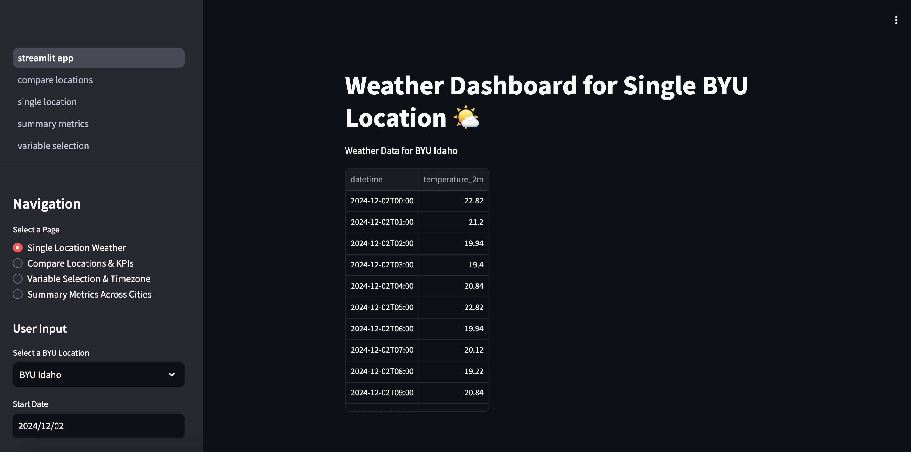
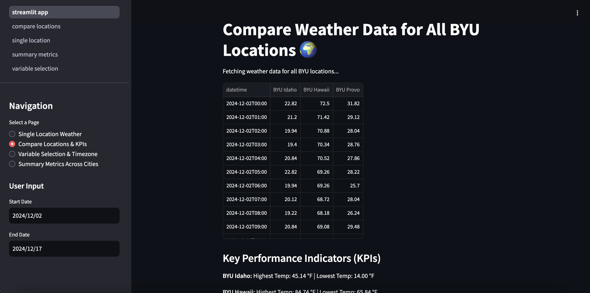
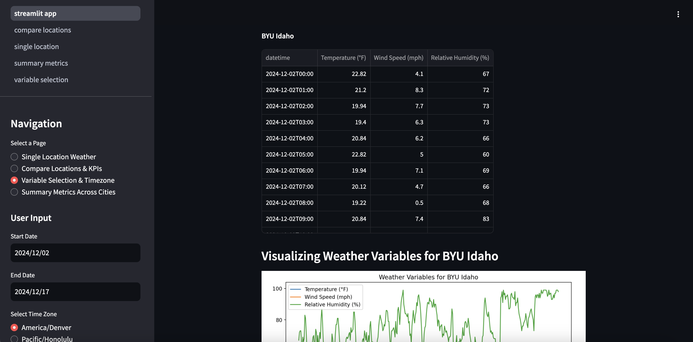
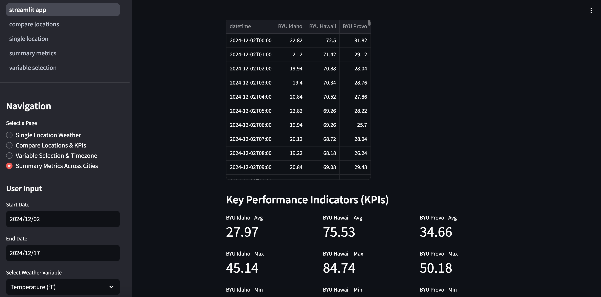

# Weather Comparison Dashboard

This project is a Streamlit app that allows users to compare weather forecasts and historical data across three different cities: Provo, Idaho, and Hawaii. The app utilizes the Open-Meteo API to gather weather data and presents it in an interactive dashboard with several useful visualizations. The app is containerized with Docker for easy deployment and has been published on Hugging Face.

**Hugging Face**: [Live Demo](https://huggingface.co/spaces/chrisgl21/weather_app)\
**Lingo Markdown**: [Click for Markdown](/lingo.md)\
**Lingo pdf**: [Click for pdf](/lingo.md)

## Project Overview

### Objective
The main objective of this project was to build a weather dashboard that compares historical forecast data with actual weather data for three cities over a 15-day period. The dashboard provides several visualizations, summary tables, and Key Performance Indicators (KPIs) to facilitate the comparison of weather patterns and aid in decision-making.

### Technologies Used
- **Streamlit**: For creating the interactive dashboard.
- **Docker**: For containerizing the app, making it easy to deploy anywhere.
- **Open-Meteo API**: For fetching weather forecast and historical weather data.
- **Polars**: For fast, in-memory data manipulation and processing.

## Features

### 1. Data Input and Selection
- Users can select a 15-day period to compare weather data across the three cities.
- Users can choose from at least ten weather variables to analyze (e.g., temperature, precipitation, humidity).
- The app allows users to select between two time zones (Hawaii or Mountain Time), and all data will be displayed in the selected time zone.

### 2. Visualizations
- **Daily Highs**: A line graph displaying the daily high temperature for each city over the selected 15-day period.
- **Hourly Boxplots**: A boxplot showing hourly temperature variation for each city.
- **Novel Visualization**: A custom visualization of your choice (details on the chosen visualization can be found in the app).

### 3. KPIs
- The dashboard displays KPIs showing the highest and lowest values for selected weather variables within the selected time period and city.

### 4. Summary Tables
- A table that compares the forecasted weather to the actual weather for each city.
- Allows easy comparison of all three cities against each other for the selected time range.

### Single Location Weather


### Compare Locations


### Variable Selection


### Summary Metrics


## Installation

### Requirements
- **Docker** (for containerized deployment)
- **Streamlit** (for the web app)
- **Python 3.x** (for local development, if not using Docker)
- **Docker Compose** (if using the compose method for deployment)

### Steps to Run Locally
1. Clone the repository:
    ```bash
    git clone https://github.com/yourusername/weather-comparison-dashboard.git
    cd weather-comparison-dashboard
    ```

2. Build the Docker image:
    ```bash
    docker build -t streamlit .
    ```

3. Run the app with Docker:
    ```bash
    docker run -p 8501:8501 -v "$(pwd):/app:rw" streamlit
    ```

4. Open your browser and go to `http://localhost:8501` to view the app.

### Using Docker Compose
If you prefer to use Docker Compose, simply run:
```bash
docker compose up
```